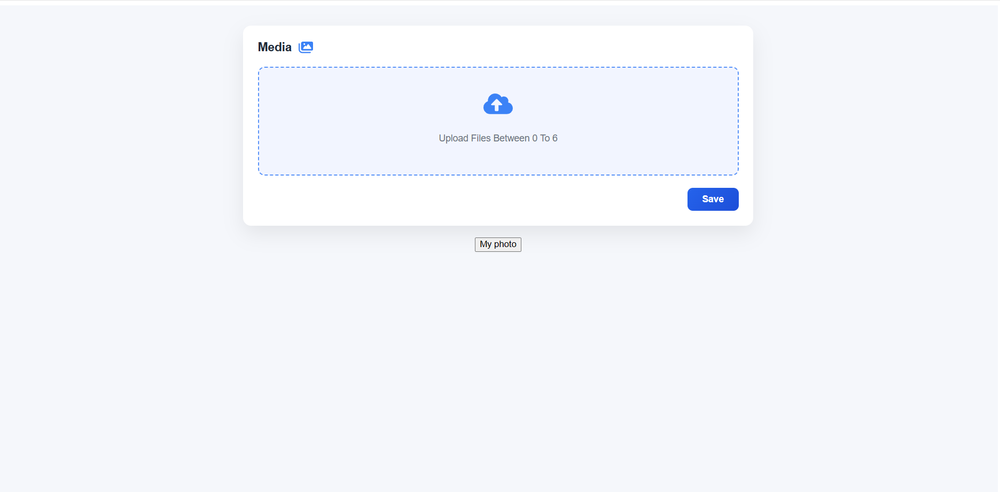
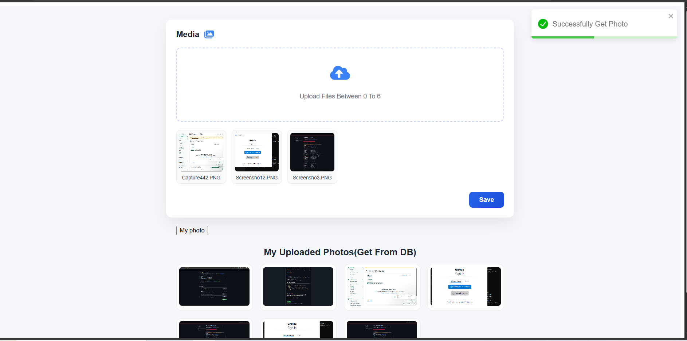

# 📸 Image Upload Application

A full-stack image upload application where users can upload **single or multiple images**, store them securely in **Cloudinary**, save image URLs in **MongoDB**, and view uploaded images from the database.

---

## 🔥 Features

- Upload single image
- Upload multiple images (up to 6)
- Image preview before upload
- Store images in Cloudinary
- Save image URLs in MongoDB
- Fetch and display uploaded images
- Clean & responsive UI
- Toast notifications for success & error

---

## 🛠 Tech Stack

### Frontend
- React
- Vite
- CSS
- React Icons
- React Toastify

### Backend
- Node.js
- Express.js
- Multer
- Cloudinary
- MongoDB
- Mongoose

---

## 📂 Project Structure
 

## 🖼 Screenshots

### Upload Page

### Image Preview Before Upload

